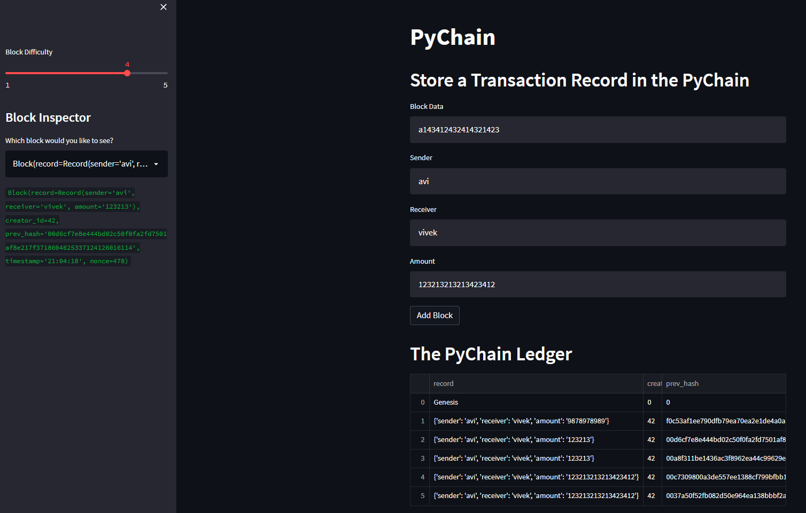
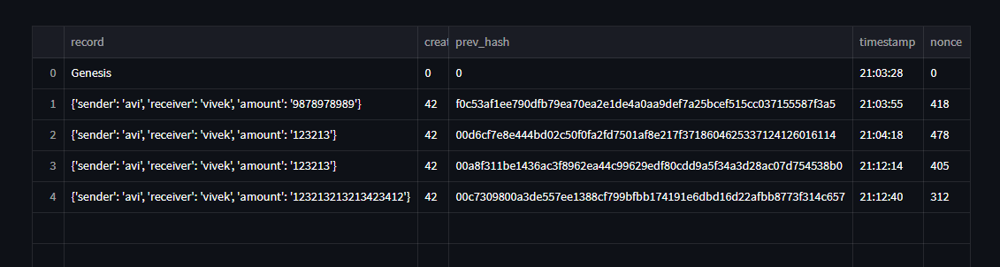
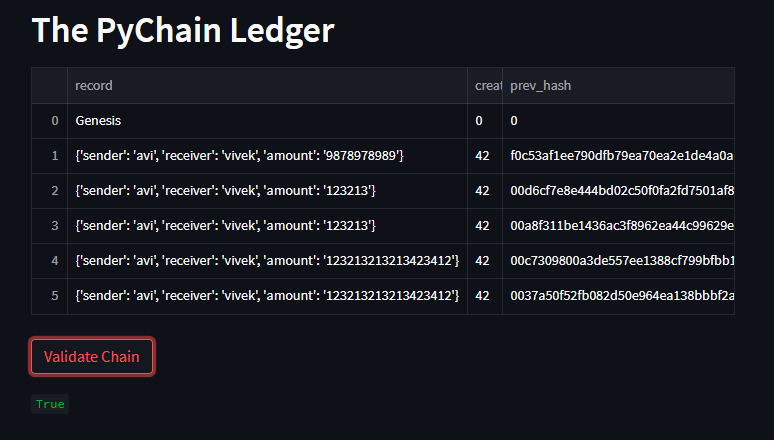

# Pychain Ledger

This ledger should allow partner banks to conduct financial transactions (that is, to transfer money between senders and receivers) and to verify the integrity of the data in the ledger.

---

## Screenshots

### Streamlit application page

### Entries to ledger

### Validation is True 

---